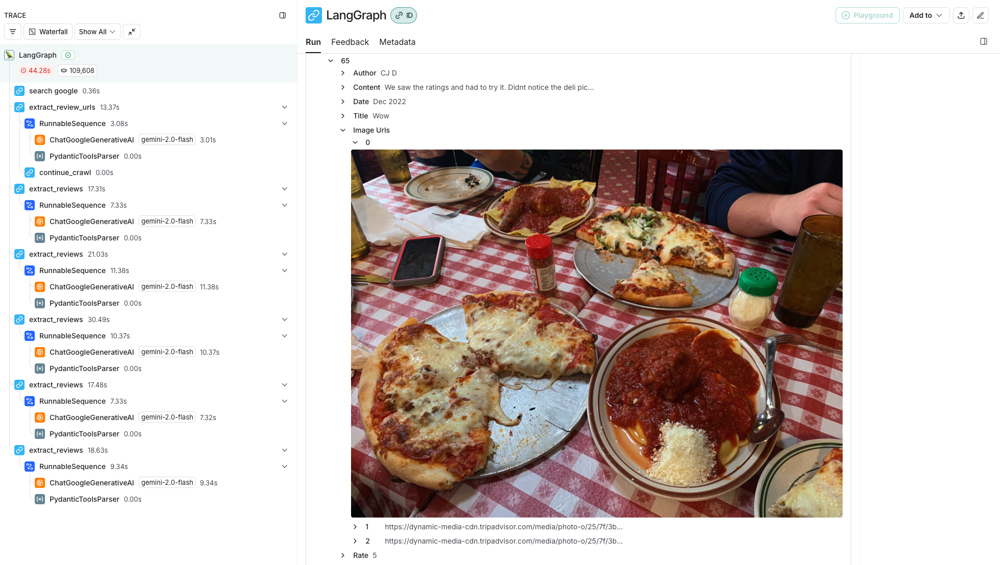
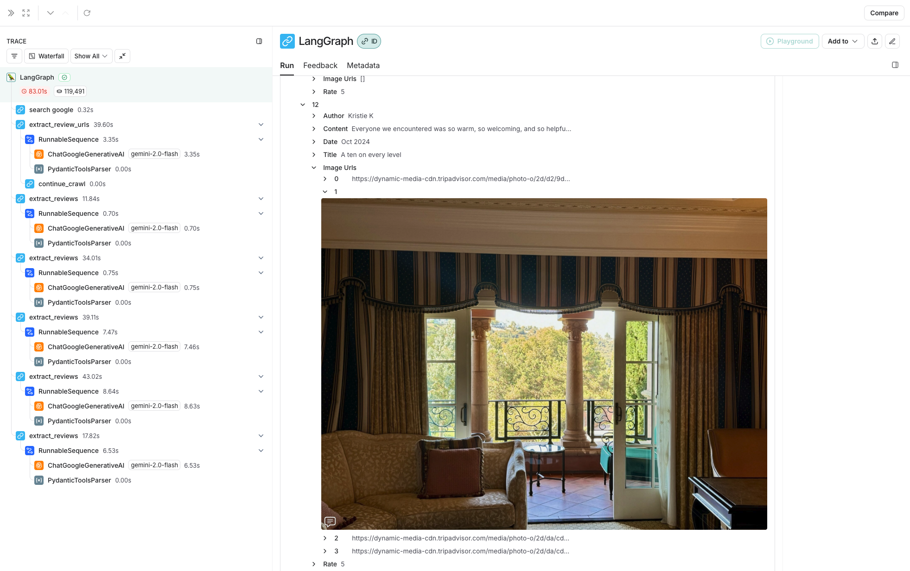

# Langchain-TripadvisorCrawler

This project is a restaurant review crawler that extracts review URLs from search results, crawls review pages, and extracts structured review data. It uses the LangChain framework with the Google Generative AI integration and BeautifulSoup for HTML parsing.

---

## Features

✅ Searches Google for a restaurant’s review page  
✅ Extracts paginated URLs for reviews  
✅ Scrapes review pages, extracting reviews, authors, ratings, dates, and images  
✅ Uses Gemini models via LangChain for URL selection and review extraction

---

## Installation

First, clone the repository and navigate to the project directory:

```bash
git clone https://github.com/jisngprk/Langchain-TripadvisorCrawler.git
cd Langchain-TripadvisorCrawler
```

Then, install the dependencies:

```
pip install -r requirements.txt
```

Environment Variables

Create a .env file in the project root with the following keys:

```env
GOOGLE_API_KEY=your_google_api_key
GOOGLE_CSE_ID=your_custom_search_engine_id
FIRECRAWL_API_KEY=your_firecrawl_api_key
```

You should add tripadvisor.com into your custom search engine

## Usage

Run the script:

```
python search_graph.py
```

It will search for a restaurant’s review page, extract paginated review URLs, and scrape reviews into structured data.

## How it works

1. Google Search
   - Uses the Google Custom Search API to find the initial review page.
2. Pagination
   - Generates paginated review URLs based on the initial URL pattern.
3. Review Extraction
   - Extracts reviews and associated metadata using a generative AI model.
4. Firecrawl Integration
   - Uses Firecrawl for fetching HTML content with a headless browser.

## Results

```python
# Restaurant review: pagination pattern is /Restaurant_Review.*-or\d+-.*\.html$

ret = search_graph.invoke({"messages": [],
                          "restaurant_name": "Filippi's Pizza Grotto Little Italy",
                           "restaurant_location": "San Diego, CA",
                           "search_domain": "tripadvisor.com",
                           "pagination_pattern": "^/Restaurant_Review.*-or\\d+-.*\\.html$"})
```



```python

# Hotel review: pagination pattern is /Hotel_Review.*-or\d+-.*\.html$
ret = search_graph.invoke({"messages": [],
                          "restaurant_name": "Fairmont Grand Del Mar",
                           "restaurant_location": "San Diego, CA",
                           "search_domain": "tripadvisor.com",
                           "pagination_pattern": "^/Hotel_Review.*-or\\d+-.*\\.html$"})

```



## License

MIT License

## Author

Jisung Park (jspark)
